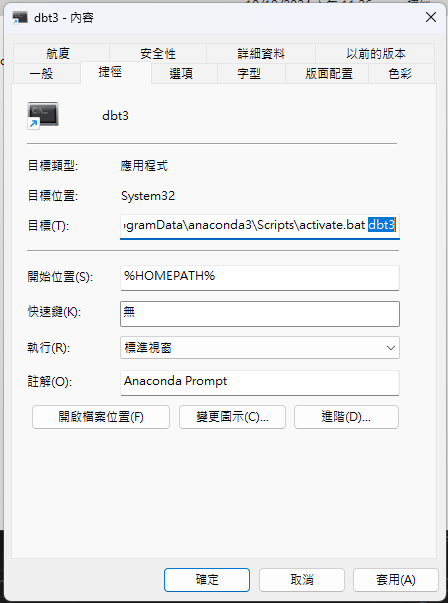

# `dbt-macros-packages` Quickstart

[](https://docs.getdbt.com/dbt-cli/cli-overview)
[](https://www.postgresql.org/)
[](https://www.python.org/)
[](https://www.docker.com/)

This is a `dbt-macros-packages` quickstart template, that supports PostgreSQL run with podman. This turtorial assumed viewer has basic DBT and Jinja knowledge. If not please have these lessons first.
  - [dbt-core-quickstart-template](https://github.com/saastoolset/dbt-core-quickstart-template)
  - [Jinja2-101-template](https://github.com/saastool/jinja2-101)
  
  This `dbt-macros-packages` quickstart taken from the various [dbt Developer Hub](https://docs.getdbt.com/guides/using-jinja) and the infrastructure is based on [dbt-core-quickstart-template](https://github.com/saastoolset/dbt-core-quickstart-template), using `PostgreSQL` as the data warehouse. 

  If you have finished dbt-core-quickstart-template before, the infrastructure and architect we using here are total the same. That is to say, you can skip directly to [Step 3 Create a project​](#3-create-a-project)

- [`dbt-core` Quickstart](#dbt-core-quickstart)
- [Steps](#steps)
  - [1 Introduction​](#1-introduction)
  - [2 Create a repository and env prepare​](#2-create-a-repository-and-env-prepare)
  - [3 Create a project​](#3-create-a-project)
  - [4 Connect to PostgreSQL​](#4-connect-to-postgresql)
  - [5 Perform your first dbt run​](#5-perform-your-first-dbt-run)
  - [6 Commit your changes​](#6-commit-your-changes)
  - [7 Checkout a new git branch​](#7-checkout-a-new-git-branch)
  - [8 Build your first model​](#8-build-your-first-model)
  - [9 Change the way your model is materialized​](#9-change-the-way-your-model-is-materialized)
  - [10 Delete the example models​](#10-delete-the-example-models)
  - [11 Build models on top of other models​](#11-build-models-on-top-of-other-models)
  - [12 Add tests to your models​](#12-add-tests-to-your-models)
  - [13 Document your models​](#13-document-your-models)
  - [14 Commit updated changes​](#14-commit-updated-changes)
  - [15 Schedule a job​](#15-schedule-a-job)
  - [16 Supplemental Install](#16-supplemental-install)

# Steps

## [1 Introduction​](https://docs.getdbt.com/guides/manual-install?step=1)

This template will develop and run dbt commands using the dbt Cloud CLI — a dbt Cloud powered command line with PostgreSQL.

- Prerequisites
  - Python/conda
  - Podman desktop
  - DBeaver
  - git client
  - visual code
  
  - ***Windows***: Path review for conda if VSCode have python runtime issue. Following path needs add and move to higher priority.

  ```
  C:\ProgramData\anaconda3\Scripts
  C:\ProgramData\anaconda3
  ```
  
- Create a GitHub account if you don't already have one.


## [2 Create a repository and env prepare​](https://docs.getdbt.com/guides/manual-install?step=2)

1. Create a new GitHub repository

- Find our Github template repository [dbt-core-quickstart-template](https://github.com/saastoolset/dbt-core-quickstart-template)
- Click the big green 'Use this template' button and 'Create a new repository'.
- Create a new GitHub repository named **dbt-core-qs-ex1**.


2. Select Public so the repository can be shared with others. You can always make it private later.
2. Leave the default values for all other settings.
3. Click Create repository.
4. Save the commands from "…or create a new repository on the command line" to use later in Commit your changes.
5. Install and setup envrionment

- Create python virtual env for dbt
  - For venv and and docker, using the [installation instructions](https://docs.getdbt.com/docs/core/installation-overview) for your operating system.
  - For conda in **Mac**, open terminal as usual

    ```command
    (base) ~ % conda create -n jinja 
    (base) ~ % conda activate jinja
    ```
    
  - For conda in **Windows**, open conda prompt terminal in ***system administrador priviledge***

    ```command
    (base) C:> conda create -n dbt dbt-core dbt-postgres
    (base) C:> conda activate dbt
    ```
    
  - ***Windows***: create shortcut to taskbar
    - Find application shortcut location

    

    - Copy and rename shortcut to venv name
    - Change location parameter to venv name
    
    

    - Pin the shortcut to Start Menu


- Start up db and pgadmin
  . use admin/Password as connection
  
  - ***Windows***:
    
    ```
    (dbt) C:> cd C:\Proj\myProject\50-GIT\dbt-core-qs-ex1
    (dbt) C:> bin\db-start-pg.bat
    ```
    
  - ***Mac***:
    
    ```
    (dbt) ~ % cd ~/Projects/dbt-macros-packages/
    (dbt) ~ % source ./bin/db-start-pg.sh
    (dbt) ~ % source ./bin/db-pgadm.sh
    ``` 

## [3 Create a project​](https://docs.getdbt.com/guides/manual-install?step=3)

Make sure you have dbt Core installed and check the version using the dbt --version command:

```
dbt --version
```

- Init project in repository home directory
  Initiate the jaffle_shop project using the init command:

```python
dbt init dbt_jinja
```

DBT will configure connection while initiating project, just follow the information below. After initialization, the configuration can be found in `profiles.yml`.

```YAML
dbt_jinja:
  outputs:
    dev:
      dbname: postgres
      host: localhost
      user: admin      
      pass: Passw0rd 
      port: 5432
      schema: dbt_jinja
      threads: 1
      type: postgres
  target: dev
```


Navigate into your project's directory:

```command
cd dbt_jinja
```

Use pwd to confirm that you are in the right spot:

```command
 pwd
```

Use a code editor VSCode to open the project directory

```command
(dbt) ~\Projects\dbt_jinja> code .
```
Let's remove models/example/ directory, we won't use any of it in this turtorial

## [4 Connect to PostgreSQL​](https://docs.getdbt.com/guides/manual-install?step=4)

- Test connection config

```
dbt debug
``` 

- Load sample data
 We should copy this data from the `db/seeds` directory.

  - copy seeds data
  **Windows**
  ```
  copy ..\db\seeds\*.csv seeds
  dbt seed
  ```

  **Mac**
  ```
  copy ../db/seeds/*.csv seeds
  dbt seed
  ```
  
- Verfiy result in database client
This command will create and insert the `.csv` files to the `dbt_jinja.raw_payments` table

## [5 Build Basic Model](https://docs.getdbt.com/guides/using-jinja?step=2)

- Open your project in your favorite code editor.
- Create a new SQL file in the models directory, named models/**order_payment_method_amounts.sql**.
- Paste the following query into the models/**order_payment_method_amounts.sql** file.

```SQL
select
order_id,
sum(case when payment_method = 'bank_transfer' then amount end) as bank_transfer_amount,
sum(case when payment_method = 'credit_card' then amount end) as credit_card_amount,
sum(case when payment_method = 'gift_card' then amount end) as gift_card_amount,
sum(amount) as total_amount
from {{ ref('raw_payments') }}
group by 1
```

- From the command line, enter

```
dbt run
```

- This SQL sums up each payment method's amount by order. This is basic SQL writting, but with some potential maintainance issues:
  - If the logic or field name were to change, the code would need to be updated in three places.
  - Often this code is created by copying and pasting, which may lead to mistakes.
  - Other analysts that review the code are less likely to notice errors as it's common to only scan through repeated code.

  So let's resolve these issues by applying macros.

## [6 Use a for loop in models for repeated SQL​](https://docs.getdbt.com/guides/using-jinja?step=3)

An intuitive approached for repeated codes is using loop, so let's give it a try:

- Edit models/**order_payment_method_amounts.sql**:
  
```SQL
select
order_id,

sum(case when payment_method = '{{payment_method}}' then amount end) as {{payment_method}}_amount,

sum(amount) as total_amount
from {{ ref('raw_payments') }}
group by 1
```

- Enter the dbt run in command-line.

- Open the compiled SQL file in /target/compiled/dbt_jinja/models/**order_payment_method_amounts.sql**. Use a split screen in the code editor to keep both files open at once to check what Jinja  has compiled.
  The compiled SQL should be the same as lest step's SQL, but is much easier to maintained.

## [7 Set Variables​](https://docs.getdbt.com/guides/using-jinja?step=4)

You can now setting variables at the top of a model, as it helps with readability, and enables you to reference the list in multiple places if required. 

- Edit models/**order_payment_method_amounts.sql**:
  
```SQL


select
order_id,

sum(case when payment_method = '{{payment_method}}' then amount end) as {{payment_method}}_amount,

sum(amount) as total_amount
from {{ ref('raw_payments') }}
group by 1
```

- Enter the dbt run in command-line.

## [8 Build models on top of other models​](https://docs.getdbt.com/guides/using-jinja?step=5)

As the previous query, our last column is outside of the `for` loop. If the last iteration of a loop is our final column, we need to ensure there isn't a trailing comma at the end, or it would cause error. like this:

```SQL


select
order_id,

sum(case when payment_method = '{{payment_method}}' then amount end) as {{payment_method}}_amount,

from {{ ref('raw_payments') }}
group by 1
```

However, we can use an `if` statement, along with the Jinja variable `loop.last`, to ensure we don't add an extraneous comma:

```SQL


select
order_id,

sum(case when payment_method = '{{payment_method}}' then amount end) as {{payment_method}}_amount
,

from {{ ref('raw_payments') }}
group by 1
```

- Execute dbt run.

## [9 Use whitespace control to tidy up compiled code](https://docs.getdbt.com/guides/using-jinja?step=6)

If you have checked the compiled SQL in the `target/compiled` folder, you might have noticed that this code results in a lot of white space.

Let's git rid of it with whitespace control we have learnt from [Jinja2-101-template](https://github.com/saastool/jinja2-101) in order to tidy up our code:

```SQL


select
order_id,

sum(case when payment_method = '{{payment_method}}' then amount end) as {{payment_method}}_amount
,

from {{ ref('raw_payments') }}
group by 1
```

- Execute dbt run.

## [13 Document your models​](https://docs.getdbt.com/guides/manual-install?step=13)

Adding documentation to your project allows you to describe your models in rich detail, and share that information with your team. Here, we're going to add some basic documentation to our project.

- Update your models/schema.yml file to include some descriptions, such as those below.
  
***models/schema.yml***

```YAML
version: 2

models:
  - name: customers
    description: One record per customer
    columns:
      - name: customer_id
        description: Primary key
        tests:
          - unique
          - not_null
      - name: first_order_date
        description: NULL when a customer has not yet placed an order.

  - name: stg_customers
    description: This model cleans up customer data
    columns:
      - name: customer_id
        description: Primary key
        tests:
          - unique
          - not_null

  - name: stg_orders
    description: This model cleans up order data
    columns:
      - name: order_id
        description: Primary key
        tests:
          - unique
          - not_null
      - name: status
        tests:
          - accepted_values:
              values: ['placed', 'shipped', 'completed', 'return_pending', 'returned']
      - name: customer_id
        tests:
          - not_null
          - relationships:
              to: ref('stg_customers')
              field: customer_id
```

- Run ***dbt docs generate*** to generate the documentation for your project. dbt introspects your project and your warehouse to generate a JSON file with rich documentation about your project.
- Run ***dbt docs serve*** command to launch the documentation in a local website.

## [14 Commit updated changes​](https://docs.getdbt.com/guides/manual-install?step=14)

- You need to commit the changes you made to the project so that the repository has your latest code.

- Add all your changes to git: git add -A
- Commit your changes: git commit -m "Add customers model, tests, docs"
- Push your changes to your repository: git push
Navigate to your repository, and open a pull request to merge the code into your master branch.

## [15 Schedule a job​](https://docs.getdbt.com/guides/manual-install?step=15)

- Instead of dbt-cloud, we will leverage airflow to schedule.
- [dbt airflow blog post](https://docs.getdbt.com/blog/dbt-airflow-spiritual-alignment)

## 16 Supplemental Install

- Visual Code Addon
  - dbt-osmosis
  - Power User for dbt
  
- Python package
  - dbt-loom
  
